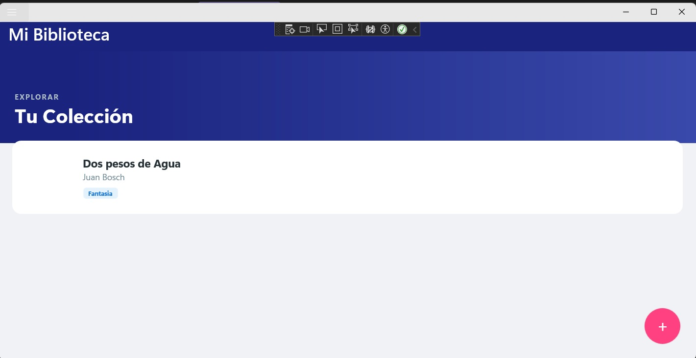
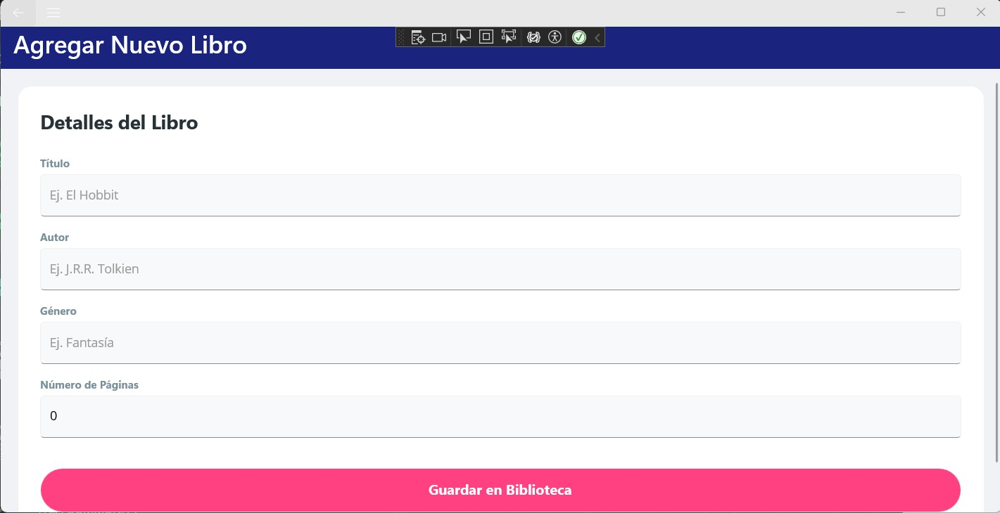
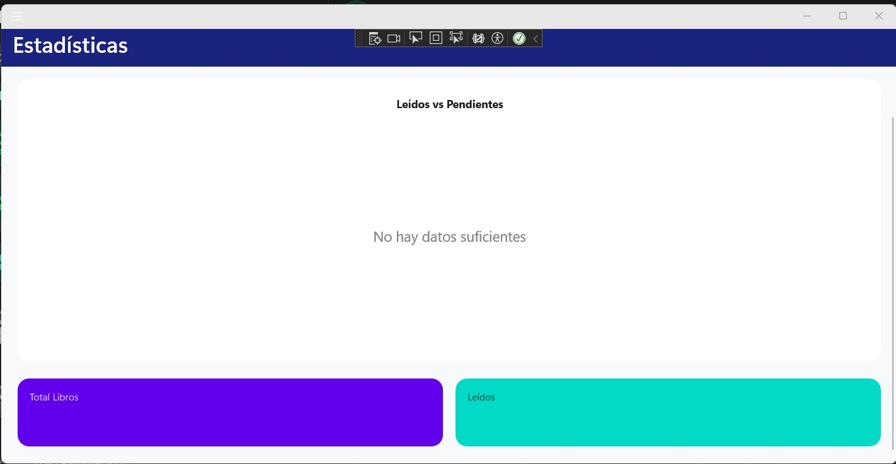
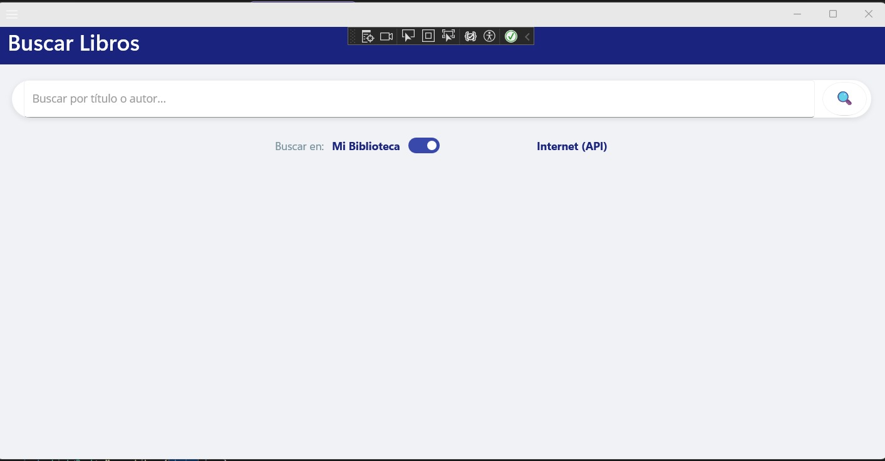

# Sistema de Gestion de Biblioteca Personal

BIBLIOTECA PERSONAL es una aplicacion movil desarrollada con .NET MAUI que permite a los usuarios gestionar de manera eficiente su coleccion de libros. La app combina almacenamiento local, consumo de APIs externas y una interfaz moderna e intuitiva para ofrecer una experiencia completa de organizacion y seguimiento de lecturas.

Este sistema utiliza una base de datos SQLite donde cada libro es representado por un modelo detallado. Los usuarios pueden realizar operaciones CRUD, aplicar filtros y visualizar estadisticas sobre su coleccion.

## Funcionalidades Implementadas

- Gestion de libros (CRUD completo): Permite agregar, visualizar, editar y eliminar registros de la biblioteca.
- Busqueda con API externa: Integracion con Google Books API para localizar titulos o autores y añadirlos a la coleccion local.
- Base de datos SQLite: Almacenamiento persistente de la informacion mediante modelos de datos estructurados.
- Estadisticas dinamicas: Visualizacion de datos mediante graficos circulares (leidos vs pendientes) y graficos de barras (distribucion por genero).
- Navegacion multi-pagina: Implementacion mediante Shell con menu lateral (FlyoutMenu).
- Interfaz personalizable: Uso de estilos globales y soporte para temas claro y oscuro mediante AppThemeBinding.
- Arquitectura MVVM: Estructura organizada basada en ViewModels, comandos y programacion asincrona.

## Base de Datos de Prueba

El sistema cuenta con los siguientes registros configurados para pruebas de visualizacion:
1. Don Quijote de la Mancha - Miguel de Cervantes
2. Cien años de soledad - Gabriel Garcia Marquez
3. 1984 - George Orwell
4. Un mundo feliz - Aldous Huxley
5. Orgullo y prejuicio - Jane Austen
6. El resplandor - Stephen King
7. Cronica de una muerte anunciada - Gabriel Garcia Marquez
8. El Hobbit - J.R.R. Tolkien
9. Rayuela - Julio Cortazar
10. Ensayo sobre la ceguera - Jose Saramago
11. Los pasos perdidos - Alejo Carpentier
12. La ciudad y los perros - Mario Vargas Llosa

## Instrucciones de Ejecucion

1. Abrir Visual Studio.
2. Seleccionar la opcion Abrir un proyecto o solucion.
3. Seleccionar el archivo con extension .sln del repositorio.
4. En el selector de destino de ejecucion, elegir entre Windows Machine, Android Emulator o dispositivo fisico.
5. Realizar clic derecho sobre el proyecto principal y seleccionar Establecer como proyecto de inicio.
6. Presionar la tecla F5 o hacer clic en el boton Iniciar.

## Capturas de Pantalla

### Pantalla Principal (Modo Claro)

### Agregar Libros

### Buscar Libros (API externa)

### Estadisticas (Modo Oscuro)

